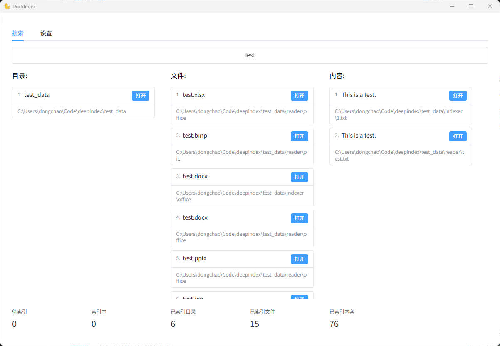
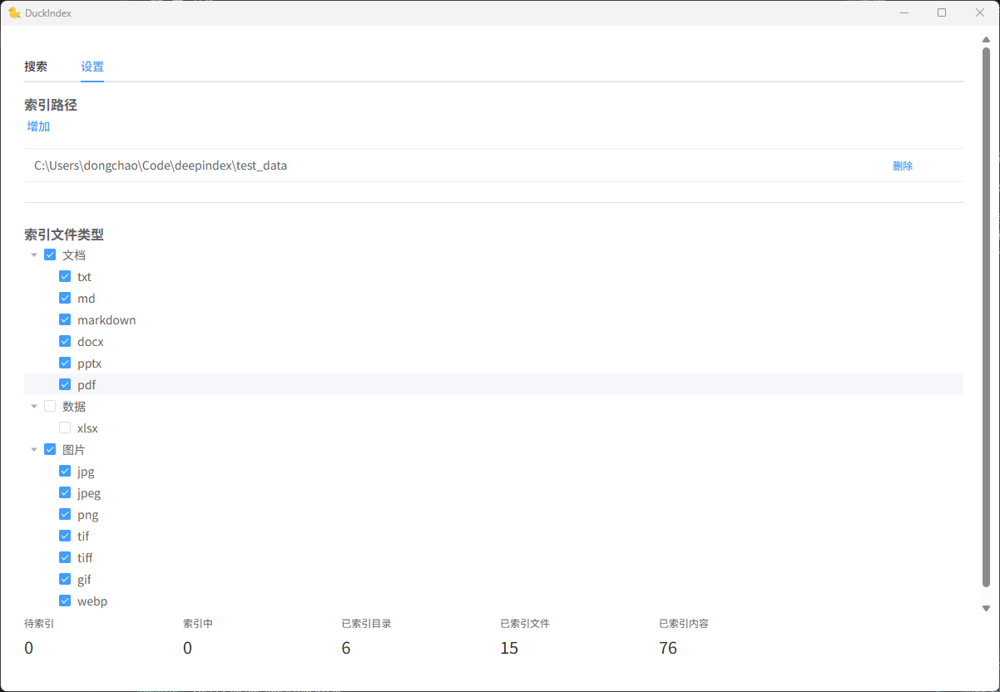

# DuckIndex


DuckIndex 是一个基于Vue+Rust编写的本地文件内容索引和搜索工具，它能够对本地文件进行深度索引，包括文件目录、文件名和文件内容，支持全文检索，让您快速找到所需信息。

下载： [DuckIndex](https://github.com/dongchao-1/DuckIndex/releases)

## 🚀 核心功能
### 🔍 精准搜索


- **全文检索**: 索引文件内容，支持关键词精确匹配
- **三列布局**: 文件名、文件路径、匹配内容，信息一目了然
- **分页加载**: 无限滚动加载搜索结果，优化大量数据展示

### ⚙️ 灵活配置


- **目录管理**: 自定义索引目录，精准控制索引范围
- **文件类型过滤**: 树形界面管理文件扩展名白名单，当前支持格式有：


| 文件类型 | 支持格式 | 提取方式 |
|---------|---------|---------|
| 文本文件 | `.txt` `.md` `.markdown` | 读取文本内容，按行拆分 |
| Office 文档 | `.docx` `.pptx` `.xlsx` | 解析文档结构，按段落拆分 |
| PDF 文档 | `.pdf` | PDF内容解析 |
| 图像文件 | `.png` `.jpg` `.jpeg` `.gif` `.bmp` `.tiff` `.webp` | OCR文字识别(Tesseract) |

### 🔧 高级特性
- **增量索引**: 智能监控文件变化，仅索引修改内容
- **DuckDB 存储**: 本地数据库存储，保证数据安全与查询性能

## 🏗️ 技术架构

### 前端技术栈
- **框架**: Vue 3 + TypeScript
- **UI 组件**: Element Plus
- **构建工具**: Vite

## 后端技术栈
- **框架**: Tauri 2.x
- **语言**: Rust
- **数据库**: DuckDB
- **OCR 引擎**: Tesseract + Leptonica
- **文档解析**: quick-xml, lopdf

## 构建系统
- **任务管理**: cargo-make
- **依赖管理**: vcpkg (C++ 依赖)
- **测试框架**: cargo-nextest
- **CI/CD**: GitHub Actions

## 💻 开发
### 推荐IDE和插件
- [VS Code](https://code.visualstudio.com/) + [Vue - Official](https://marketplace.visualstudio.com/items?itemName=Vue.volar) + [Tauri](https://marketplace.visualstudio.com/items?itemName=tauri-apps.tauri-vscode) + [rust-analyzer](https://marketplace.visualstudio.com/items?itemName=rust-lang.rust-analyzer)

### 1. 安装基础环境
* 安装rust: https://www.rust-lang.org/tools/install
* 安装node.js v22:
```powershell
choco install nodejs-lts --version=22.19.0 -y
```
* 安装Visual Studio生成工具（安装C++依赖）：
```powershell
choco install visualstudio2022enterprise --version=117.14.14 -y --package-parameters "--add Microsoft.VisualStudio.Component.VC.Tools.x86.x64 --add Microsoft.VisualStudio.Component.VC.CMake.Project --add Microsoft.VisualStudio.Component.VC.Llvm.Clang --add Microsoft.VisualStudio.Component.VC.Llvm.ClangToolset --add Microsoft.VisualStudio.Component.Windows11SDK.22621"
```
* 安装just: 
```powershell
cargo install just
```

### 2. 安装依赖
```powershell
just install
```

### 3. 编写代码
编写代码，添加测试用例

### 4. 运行测试
```powershell
just test
just test-debug
```

### 5. 运行开发版本
```powershell
just dev
just dev-debug
```

### 6. 检查test、clippy、fmt
```powershell
just format
just check
```

### 7. 构建生产版本
```powershell
just release
```

### 重要路径
- 应用数据: `%APPDATA%\DuckIndex`
- 测试临时目录: `%TEMP%`

---

**DuckIndex** - 让本地文件搜索变得简单高效 🔍✨
